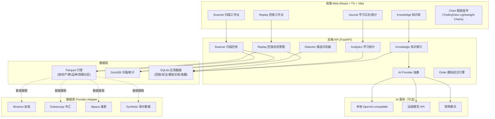
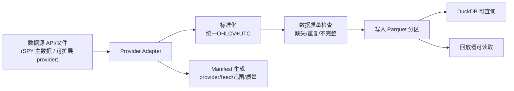
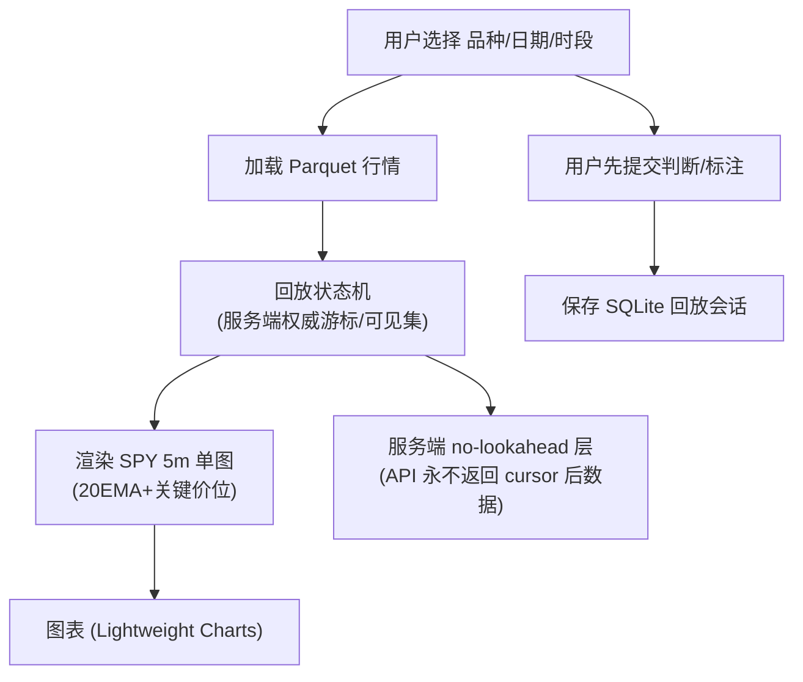
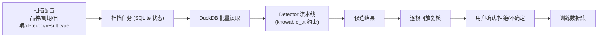
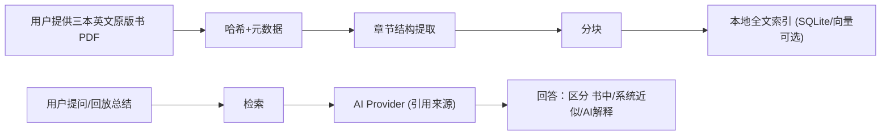

# Price Action Learning Lab · 系统架构

> Milestone 0 架构文档。包含：总体架构、数据流图、技术栈、组件职责、关键设计原则。
> 已对齐 canonical：`docs/product/PRD.md`、`docs/content-provenance-policy.md`、`docs/architecture/brooks-system-design-implications.md`。

## 一、总体架构（Monorepo，本地优先）



### 架构要点
- **前后端分离**：`apps/api`（Python/FastAPI）与 `apps/web`（TypeScript/React）。
- **存储职责分离**：Parquet（行情）/ DuckDB（扫描统计）/ SQLite（事务型应用数据）。
- **数据源适配**：provider adapter 模式，业务逻辑不依赖具体数据商；第一阶段唯一正式训练品种为 **SPY**（provider abstraction 保留，其他 provider 属 Research Extension）。
- **统一结构层**：shared structure primitives + versioned structure profile + thin candidate detectors；**不写巨型 MarketStructureEngine**，也不在 API route 内实现核心 detector。
- **AI 解耦**：provider-neutral 接口，可禁用，核心功能不依赖 AI。
- **AI 边界**：AI 不先给交易答案、不做最终交易决策、不冒充 Brooks；原书证据不足时明确回答"没有足够依据"，不编造页码。
- **远程模型隐私/版权**：本地优先；书籍内容受版权，默认**不发送到远程模型**。仅当用户显式开启并同意（设置项，默认关闭）时才允许把书籍片段发送到远程模型，且必须提示用户已发送片段内容；禁用/本地模式下完全不外传。

## 二、数据流图

### 2.1 行情数据摄取流（数据层基础）



> 第一阶段唯一正式训练品种为 **SPY**；Binance/Dukascopy/Alpaca 等 provider 保留 adapter 抽象，但不同时在阶段一并行接入（属 Research Extension）。

### 2.2 逐根回放流（核心能力，MVP-A Replay Trainer）



> 第一阶段**唯一核心决策图为 SPY 5 分钟单图**，**不要求同时观察 1h 图**；1h/多周期为 Research Extension，不在此流程渲染。

### 2.3 候选扫描流（核心能力，MVP-D Scanner）



### 2.4 知识库流（Early 部分可与 MVP 并行，完整功能属 Later）



> **知识库优先级（不阻塞 Replay MVP）**：
> - Early：PDF 文本提取、glossary、chapter/section、基础引用。
> - Later：Figure extraction、chunk↔figure 关联、图表显示原书 Figure、原书案例历史行情重建。
> - OCR 仅作 fallback，用于无法直接提取文本的扫描页，**不删除**；具体策略待实际导入验证。
> - 引用协议遵循 content-provenance-policy 第五章：`print_page` 不可靠时为 `null`、禁止编造页码、`chunk` 可追溯。
> - 完整 RAG / AI coach / Figure extraction **不属于 MVP-A**，后置于知识库里程碑（roadmap "Later"），不阻塞 Replay MVP。

## 三、技术栈

| 层 | 技术 | 用途 |
|---|---|---|
| 后端语言 | Python 3.12+ | 全部后端逻辑 |
| API 框架 | FastAPI + Pydantic | 类型化 REST API |
| 数据帧 | Polars + PyArrow | 行情处理、批量计算 |
| 扫描引擎 | DuckDB | 直接查询 Parquet、扫描统计 |
| 事务存储 | SQLAlchemy 2 + Alembic + SQLite (WAL) | 应用数据、migration |
| CLI | Typer | 数据下载、本地命令 |
| 测试 | pytest + Ruff + mypy/Pyright | 测试/lint/类型 |
| HTTP | httpx | 数据源请求 |
| 前端 | TypeScript + React + Vite | Web 界面 |
| 图表 | TradingView Lightweight Charts | K线渲染、逐根回放 |
| 状态/查询 | Zustand + TanStack Query | 前端状态/服务端缓存 |
| 路由 | React Router | 页面路由 |
| 前端测试 | Vitest + React Testing Library + Playwright | 测试 |
| 容器化 | Docker Compose | api + web（可选） |

## 四、关键设计原则（呼应需求文档）

1. **no lookahead by construction**：detector 记录 `event_time` 与 `knowable_time`，扫描/回放只在 `knowable_time` 后显示。
2. **依赖倒置**：数据源经 provider adapter；AI 经 provider-neutral 接口；核心领域逻辑不依赖 UI。
3. **候选而非答案**：detector 支持多 result type（boolean/categorical/ordinal/continuous/count/evidence_set），不强制 0~1 score；evidence 比 score 重要，输出标为"候选"。
4. **职责分离**：Parquet/DuckDB/SQLite 各司其职，不混用不同来源数据。
5. **可测试**：核心领域逻辑与 FastAPI 路由、React UI 解耦。
6. **配置与代码分离**：密钥从 `.env` 加载，不进 Git。

## 五、本地存储布局

```
data/
  demo/         # 演示/合成数据（零密钥可跑）
  market/       # Parquet 行情分区
  imports/      # 用户导入的原始数据
  knowledge/    # 书籍/知识资料
  exports/      # 导出
```

---

*本文档与 PRD、领域模型、数据合同、API草案、ADR、风险清单、路线图共同构成 Milestone 0 架构交付。*