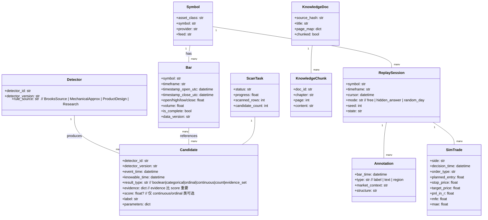

# Price Action Learning Lab · 核心领域模型

> Milestone 0 架构文档。定义系统核心领域对象、关系与关键约束。
> 术语依据《Al Brooks 价格行为体系 · 核心术语表》（data/knowledge/01_核心术语表...）与三本书精读笔记。
> 已对齐 canonical：`docs/product/PRD.md`、`docs/content-provenance-policy.md`、`docs/architecture/brooks-system-design-implications.md`。

## 一、领域总览（核心实体关系）



## 二、核心聚合根

### 2.1 Symbol（品种）
- 唯一标识：`asset_class + symbol + provider + feed`
- 领域规则：不同 provider/feed 的数据**不得静默混用**；每个数据集有 manifest。

### 2.2 Bar（K线，值对象）
- 标准化 OHLCV，时间统一 UTC。
- `is_complete` 标记：未完成K线不得用于前视。
- 属于某 Symbol + timeframe，对应某 Parquet 分区。

### 2.3 Detector（候选识别器）
- 独立、可测试、可版本化模块。
- `rule_source` 遵循内容来源四层分层：`BrooksSource` / `MechanicalApprox` / `ProductDesign` / `Research`（不再用单一 book/mechanical/ai 三分）。
- 每个 detector 有规格文档（`docs/concepts/<concept>.md`，见 concepts/README.md 强制流程）与测试。

### 2.4 Candidate（候选结果）
- **核心防前视约束**：`event_time`（实际发生时间）与 `knowable_time`（系统首次可知时间）分离。
- 扫描/回放**只能在 `knowable_time` 之后显示**该信号。
- 支持多 `result_type`（boolean/categorical/ordinal/continuous/count/evidence_set），**不强制 0~1 score**；`evidence`（可展开依据）比 score 重要，score 仅用于 continuous/ordinal 类。
- 输出为"候选"，非权威答案。

### 2.5 ReplaySession（回放会话）
- 状态机：`idle → playing → paused → awaiting_judgment → completed`
- `cursor` 记录当前回放游标；保存/恢复时游标一致。
- `mode`：自由 / 隐藏答案 / 随机日。
- `seed` 保证随机日可复现。

### 2.6 Annotation（标注）与 SimTrade（模拟交易）
- Annotation：对任意K线/区间加标签、文本、市场背景、结构、置信度、来源书籍页码。
- SimTrade：记录方向/入场/止损/目标/风险/理由；成交引擎处理市价/限价/停止单，同根K线触及止损和目标时**默认 pessimistic**。

### 2.7 ScanTask（扫描任务）
- 本地任务，状态：pending/running/completed/failed/cancelled。
- 带进度、scanned_rows、candidate_count。不引入分布式队列。

### 2.8 KnowledgeDoc / KnowledgeChunk（知识库）
- 用户提供书籍 → 哈希 → 章节提取 → 分块 → 索引。
- 回答必须可引用书名/章节/页码；区分内容来源四层（Brooks Source / Mechanical Approximation / Product·Engineering Design / Research Extension）。

## 三、关键领域约束（对应 Brooks 体系）

| 约束 | Brooks 依据 | 工程实现 |
|---|---|---|
| 候选非答案 | 概率思维、形态是倾向 | evidence 比 score 重要；多 result type，四档人工确认 |
| event_time ≠ knowable_time | swing 需右侧确认、signal bar 先收盘 | detector 记录两个时间，防前视 |
| 趋势 vs 区间是第一判断 | 市场两种基本状态 | 认知中枢；自动化属较晚 Mechanical Approximation |
| 反转 = 失败突破 | "所有反转都以失败突破开始" | detector 先找突破，再看是否失败 |
| 只读5分钟单图、不降1分钟 | 作者主张 | 第一阶段唯一核心决策图为 SPY 5m 单图；1h/多周期为 Research Extension |
| 逆势高风险 | countertrend 是亏损主因 | 标注市场背景与信号方向一致性 |

## 四、识别器（Candidate Detector）统一规范

每个 detector 需具备（详见 `docs/concepts/README.md` 模板与 content-provenance-policy §九）：

```
detector_id:            唯一标识，如 "inside_bar"
detector_version:      语义化版本，如 "0.1.0"
rule_source:           BrooksSource | MechanicalApprox | ProductDesign | Research
result_type:           boolean | categorical | ordinal | continuous | count | evidence_set
输入定义:               需要哪些 Bar 窗口/参数
输出结构:               Candidate 标准结构（evidence 优先，score 可选）
数学/逻辑规则:          可测试的判定逻辑
参数:                  可调参数及默认值
边界案例:              易混淆/临界情形
正例测试/反例测试:       自动化用例
防前视测试:             验证 knowable_time 约束
图表可视化:             在界面上如何呈现依据
```

## 五、Level 分层（学习顺序，Provenance 见 PRD）

> Level 0-6 代表**学习顺序**（learning_priority），不等同于开发顺序；开发顺序用 automation_priority。权威见 `docs/product/PRD.md` 第四章。

- **Level 0 市场时间与基础上下文**：opening context、previous day levels、premarket、session behavior、opening price（Provenance 混合：Brooks Source + Product/Market Data Infrastructure）
- **Level 1 单根K线与信号K线**：OHLC/body/tails、bull/bear bar、trend bar、doji、reversal bar、signal bar、entry bar、inside/outside、ii/iii/ioi（Brooks Source，learning early · automation early）
- **Level 2 几何与市场结构**：local extreme、swing high/low、leg、trend line、channel line、channel、horizontal key level、gap、measured move、EMA gap bars（Brooks Source，learning early · automation early/middle）
- **Level 3 回调、bar counting 与突破**：pullback、H1/H2/H3/H4、L1/L2/L3/L4、second entry、breakout、breakout pullback、failed breakout、double top/bottom（**Brooks Source · learning early · automation middle，依赖 swing/leg/pullback；H1/H2/L1/L2 属基础路线，非 Research Extension**）
- **Level 4 市场环境**：trend↔range spectrum、tight trading range、barbwire、breakout mode、opening context、day type、spike、always-in candidate（Brooks Source，learning very_early · automation later）
- **Level 5 复杂 Brooks 结构**：wedge、micro channel、spike and channel、climax、final flag、expanding triangle、pattern evolution（**Brooks Source + Later，非 Research Extension**）
- **Level 6 交易计划**：trader's equation、two reasons、entry、protective stop、target、scalp vs swing、trade management、probability self-estimation、MFE/MAE、post-trade review（Brooks Source + Product Analytics）

> ⚠️ H1/H2/L1/L2 **不属于后期复杂 detector，也不属于 Research Extension**；wedge/climax/always-in 是 Brooks Source，只是开发优先级为 Later。

---

*本文档是 Milestone 0 领域模型交付。核心概念：Symbol、Bar、Detector、Candidate（含 event/knowable_time）、ReplaySession、Annotation、SimTrade、ScanTask、KnowledgeDoc/Chunk。*