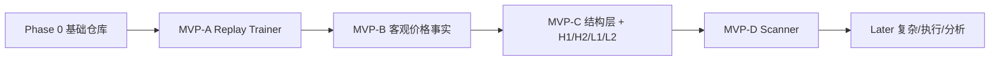

# Price Action Learning Lab · 项目目录 与 分阶段路线图

> Milestone 0 架构文档。定义完整仓库目录结构与分阶段开发路线图。
> 已对齐 canonical：`docs/product/PRD.md`（第三章产品递进 MVP-A/B/C/D → Later）、`docs/content-provenance-policy.md`、`docs/architecture/brooks-system-design-implications.md`。

## 一、项目仓库目录结构

```
price-action-learning-lab/
├── apps/
│   ├── api/                      # 后端 FastAPI
│   │   ├── app/
│   │   │   ├── api/              # REST 路由
│   │   │   ├── core/             # 配置、日志、依赖注入
│   │   │   ├── domain/           # 领域模型/值对象/领域服务
│   │   │   ├── services/         # 应用服务（回放/扫描/统计/知识库）
│   │   │   ├── repositories/     # 数据访问
│   │   │   ├── data_providers/   # provider adapter 抽象（第一阶段仅 SPY；其他 provider 为 Research）
│   │   │   ├── structure/        # shared structure primitives + versioned structure profile
│   │   │   ├── detectors/        # thin candidate detector（依赖 structure 层，非巨型引擎）
│   │   │   ├── replay/           # 回放状态机（no-lookahead）
│   │   │   ├── knowledge/        # 书籍索引/检索
│   │   │   ├── analytics/        # 学习统计
│   │   │   ├── models/           # SQLAlchemy ORM
│   │   │   ├── schemas/          # Pydantic schema
│   │   │   └── db/               # SQLite/Alembic migration
│   │   ├── tests/
│   │   ├── pyproject.toml
│   │   └── Dockerfile
│   └── web/                      # 前端 React+TS+Vite
│       ├── src/
│       │   ├── app/              # 路由/布局
│       │   ├── api/              # API 客户端
│       │   ├── components/       # 通用组件
│       │   ├── chart/            # Lightweight Charts 封装
│       │   ├── replay/           # 回放工作台
│       │   ├── scanner/          # 扫描工作台
│       │   ├── journal/          # 日志/统计
│       │   ├── knowledge/        # 知识库
│       │   ├── analytics/        # 分析仪表盘
│       │   ├── stores/           # Zustand 状态
│       │   ├── types/            # TS 类型
│       │   └── utils/
│       ├── tests/
│       ├── package.json
│       └── Dockerfile
├── data/
│   ├── demo/                     # 演示/合成数据（零密钥可跑）
│   ├── market/                   # Parquet 行情分区
│   ├── imports/                  # 用户导入原始数据
│   ├── knowledge/                # 书籍/学习资料
│   └── exports/                  # 导出
├── docs/
│   ├── product/                  # PRD、一致性核对表
│   ├── architecture/             # 架构/领域模型/数据合同/ADR/路线图（含已废弃 assumptions.md）
│   ├── concepts/                 # Concept Specs（detector 实现前必须先有 <concept>.md）
│   ├── knowledge/                # Brooks 原书笔记/提取文本（参考资料）
│   ├── user-guide/               # 用户手册（MVP-A 可用后创建）
│   ├── README.md                 # docs/ 文档地图
│   └── document-inventory.md     # 全仓文档登记表
├── scripts/                      # 本地脚本（数据下载等）
├── docker/                       # 容器相关
├── compose.yaml
├── .env.example
├── README.md
├── CONTRIBUTING.md
└── LICENSE
```

## 二、分阶段路线图（MVP-A/B/C/D → Later）

> 旧版 Milestone 0-9（M0→M9 一次性规划，H1/H2 被排到 M8、知识库 M7 先于 MVP）已被 PRD 的**产品递进**取代，权威见 `docs/product/PRD.md` 第三章。**第一件可用产品是 Replay Trainer（MVP-A）**，H1/H2 属基础路线（MVP-C），wedge/climax 等属 Later。

### Phase 0：可运行基础仓库（MVP-A 技术底座）
- FastAPI 启动、React 启动、Docker Compose、SQLite migration、DuckDB 初始化、演示数据、健康检查、CI、格式化/lint/测试命令、基础错误处理。
- **验收**：`docker compose up --build` 后打开网页看到演示行情列表。

### MVP-A：Replay Trainer（首个可用产品）
- **SPY 数据**、1m raw → 5m 聚合、交易日历 / RTH、20 EMA、opening price、previous day H/L/C、premarket H/L。
- 服务端 **no-lookahead replay**（权威 cursor，API 永不返回 cursor 之后数据）、Predict First Reveal Later、基础标注、保存/恢复。
- > **此阶段可完全没有复杂 detector。目标：用户能真正进行 Brooks 风格 bar-by-bar 历史训练。**

### MVP-B：客观价格事实
- bar anatomy、bull/bear bar、trend bar、doji、inside/outside、ii/iii/ioi、基础 signal bar evidence（Brooks Source，低歧义、易验证）。

### MVP-C：结构层
- local extreme、swing、leg、pullback、trend line、channel line、bar counting 基础结构。
- 然后实现：**H1/H2、L1/L2、second entry**（Brooks 基础路线，learning early · automation middle，依赖 swing/leg/pullback）。
- > 目标：系统第一次能辅助用户学习 Brooks 最核心的回调与二次入场逻辑。

### MVP-D：Scanner
- 批量扫描、candidate review（confirmed/rejected/uncertain）、错题本、blind recheck。
- > 只有 detector 已可人工验证后，才增加。

### Later
- always-in、wedge、spike and channel、climax、final flag、day type 复杂识别、完整交易管理、复杂成交模拟。
- 知识库 Figure 提取、AI coach、三 provider 并行、1h 多周期（Research Extension）。

> 知识库（Early 部分：PDF 文本提取/glossary/基础引用）与 AI provider 抽象**不阻塞 MVP-A**，可并行演进；Figure/RAG/AI coach 属 Later/Research。

---

## 三、里程碑依赖关系



> 依赖原则：MVP-A 完全不依赖复杂 detector / 知识库 / AI / 多市场 / 多周期；知识库 Early 部分与 AI provider 抽象可与 MVP 并行，但不阻塞 MVP-A。

---

## 四、编码原则（贯穿所有里程碑）

- 类型优先、小模块、清晰领域边界、依赖倒置、可测试、可解释、可复现。
- 配置与代码分离；数据版本化；detector 版本化；数据库 migration。
- **no lookahead by construction**（防前视内建）。
- 禁止：大型万能 service、路由中实现核心逻辑、前端直接计算 detector、硬编码密钥、把 AI 输出当权威标签、伪造盈利、第一版实盘。

---

*本文档是 Milestone 0 架构交付的收尾文档。*